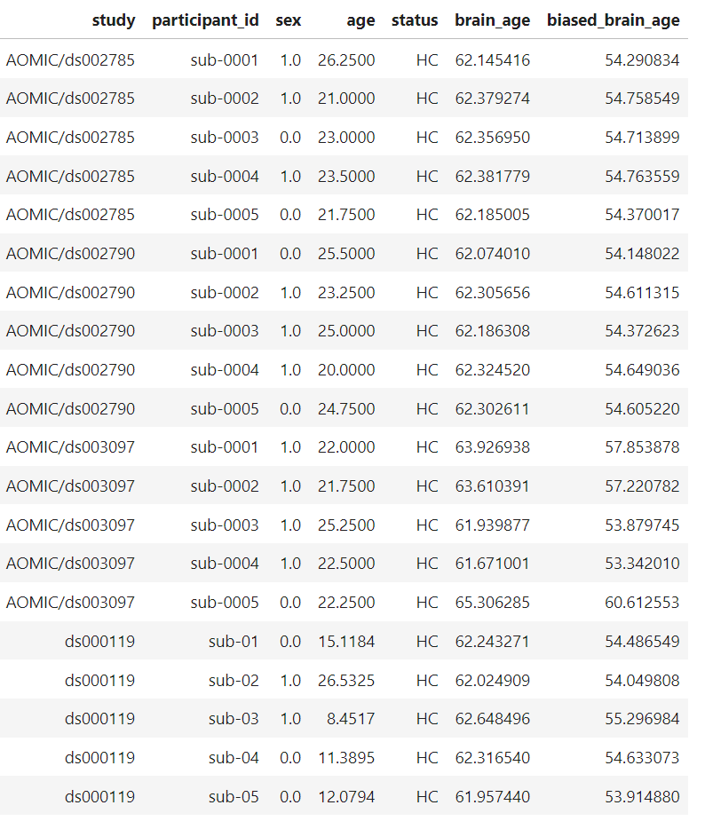
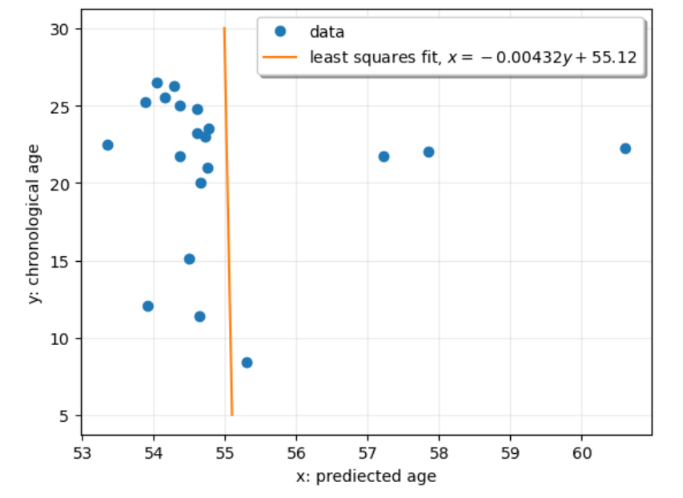

# `Training.ipynb`

Code to build cVAE via Keras

Most copied from the original cVAE repository

(160, 192, 160) is too large for my PC to experiment

# `nii_and_h5_file_format.ipynb` : 

Info about how to handle `.nii` and `.h5` files.

#  `Inference_brain_age.ipynb`:  

Use pre-trained SFCN model to predict brain age of the 20 scans in the small dataset

**Inference**：

* data flow: 

  .h5 file -> numpy array -> reshape to (batch_size, 1, 160, 192, 160) -> tensor as model input

* bins: 

  14-94, with 2 years interval

**Result:**

* 20 scans in total, all around 53 years old

  ​	

* Bias Correction:

  **SOMETHING IS WRONG HERE**

  ​	