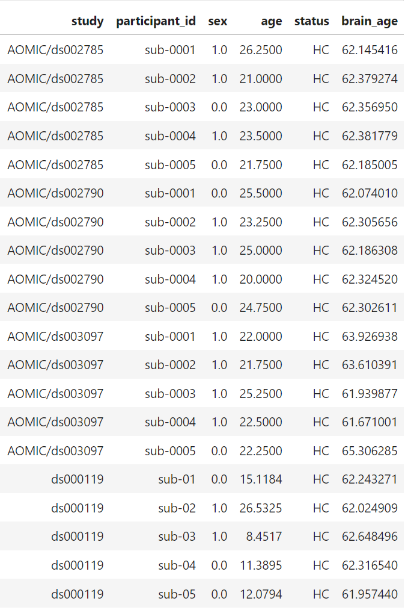

`nii_and_h5_file_format.ipynb` : Info about how to handle `.nii` and `.h5` files.

`Inference_brain_age.ipynb`:   Use pre-trained SFCN model to predict brain age of the 20 scans in the small dataset

**Inference**：

data flow: .h5 file -> numpy array -> reshape to (batch_size, 1, 160, 192, 160) -> tensor as model input

**Questions:**

1. chronological age out of range (42, 82)

2. don't need the "preprocess steps":

   ```python
   data_prep_0 = data_raw/data_raw.mean()
   data_prep = dpu.crop_center(data_prep_0, (160, 192, 160))
   ```

   

**Result:**

20 scans in total, all around 62 years old (<u>not sure if correct</u>)

​	

